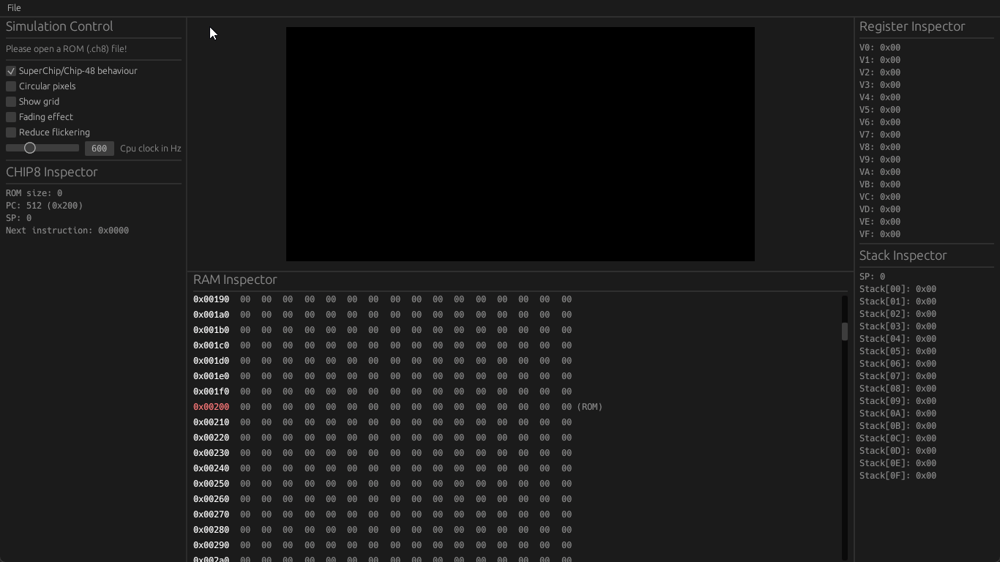

# rusty_chip

Yet another CHIP-8 emulator.



# What

A binary for CHIP-8 emulation. Has:
* Graphics and sound(beep).
* Friendly UI
* Debugging capabilities
  * inspect program counter, stack, RAM, etc.
  * Pause and step instruction by instruction
  * Reset to initial state.
* Two modes of operation - `Play only` or `Debug`.
* Configurations:
  * Choose between `CHIP-8` or `Super-CHIP` instruction behaviour.
  * Set the CPU clock from 1 to 2000 Hz.

# How

Written in rust using the `bevy` game engine which is a massive overkill for such project.

# Why

To get my hands dirty with `rust` and `bevy`.

# Usage

In order to use the emulator just for playing simply:

```
cargo run --release
```

If you also want to use it for debuggin you can call it like this:
```
cargo run --release debug
```

# TODO

Possible improvements would be:
- [ ] Better visuals
  - [ ] Reduced flickering - non at all or fading effect
  - [ ] Configurable pixel size, color and shape
- [ ] Editable register, PC, RAM, etc. values
- [ ] Integrated text editor for editing and testing chip-8 programs

# Dependancies

* [bevy 0.9](https://github.com/bevyengine/bevy) - The overkill game engine.
* [bevy_egui](https://github.com/mvlabat/bevy_egui) - Bevy egui integration. Immidiate mode GUI in the likes of ImGui.
* [bevy_pixel_buffer](https://github.com/Zheoni/bevy_pixel_buffer) - Pixel framebuffer with egui and rayon integration.
* [rfd](https://crates.io/crates/rfd) - File dialogs library.

# Thanks

* [The guide](https://tobiasvl.github.io/blog/write-a-chip-8-emulator/) that started me on this emulator. Thanks, Tobias.
* [Chip-8 test suite](https://github.com/Timendus/chip8-test-suite) whitout which I wouldn't have caught a couple of nasty bugs.
* [A great collection of roms](https://github.com/loktar00/chip8/tree/master/roms) for testing and playing around.

